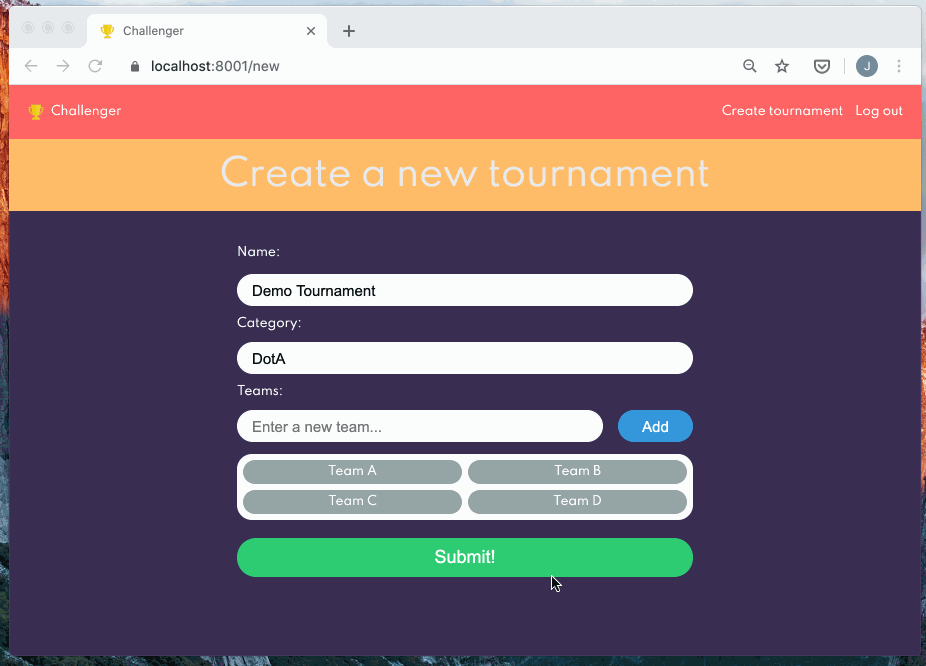
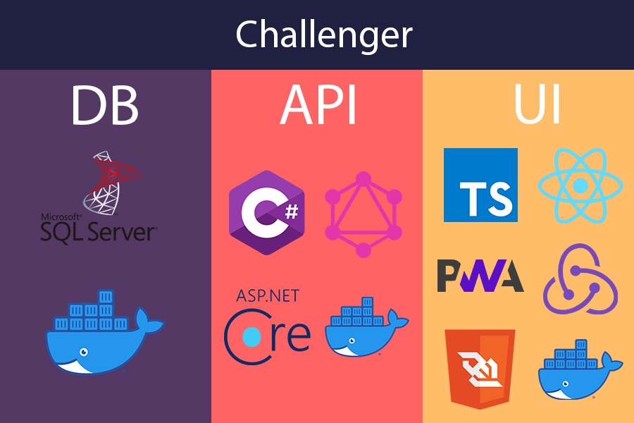
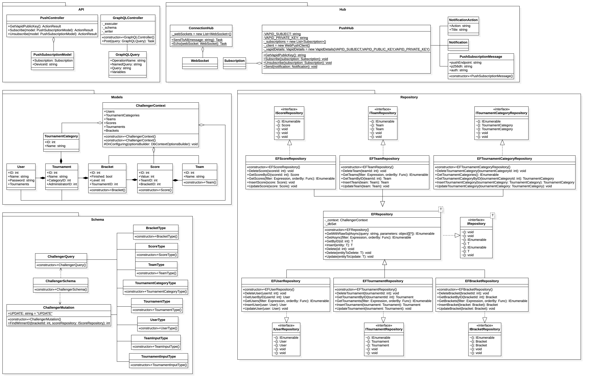

# Challenger

Challenger is a web application that support all kind of games with user management.
It users Team VS. Team brackets as game type. 

<p align="center">
  
</p>

## Getting Started

### Execution

```sh
./run.sh
```

OR

```sh
docker pull mcr.microsoft.com/mssql/server
docker run -d --name challenger-db -e 'ACCEPT_EULA=Y' -e 'SA_PASSWORD=Password123' -p 1433:1433 mcr.microsoft.com/mssql/server:latest
SERVER_URL_OR_NAME=$(docker inspect --format '{{ .NetworkSettings.IPAddress }}' challenger-db)
sed -i'.original' -e "s/SERVER_URL_OR_NAME/$SERVER_URL_OR_NAME/g" ./Models/appsettings.json
docker build -t challenger-service .
docker run -d -it -p 8000:80 -p 8001:443 -e ASPNETCORE_URLS="https://+;http://+" -e ASPNETCORE_HTTPS_PORT=8001 -e ASPNETCORE_Kestrel__Certificates__Default__Password="password" -e ASPNETCORE_Kestrel__Certificates__Default__Path=/https/aspnetapp.pfx -v ${HOME}/.aspnet/https:/https/ --name challenger-service challenger-service
mv Models/appsettings.json.original Models/appsettings.json
```

### Migrations

```sh
dotnet ef database drop
dotnet ef migrations remove
dotnet ef migrations add InitialCreate
dotnet ef database update
```

## Architecture



### Class Diagram
The core base of the application is using C#.




## License

This project is licensed under the MIT License - see the [LICENSE.md](LICENSE.md) file for details
